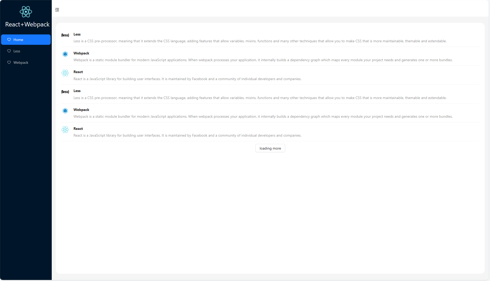
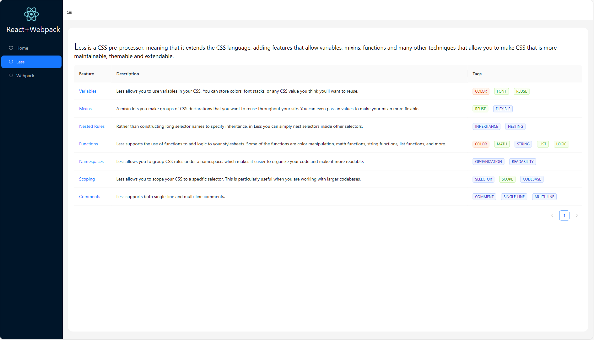
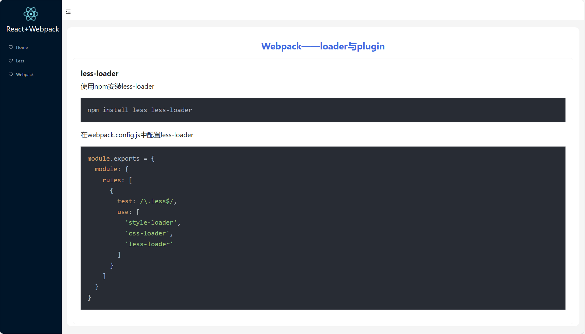
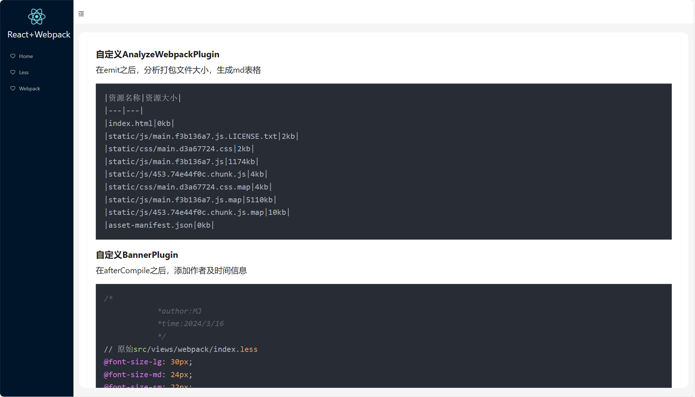
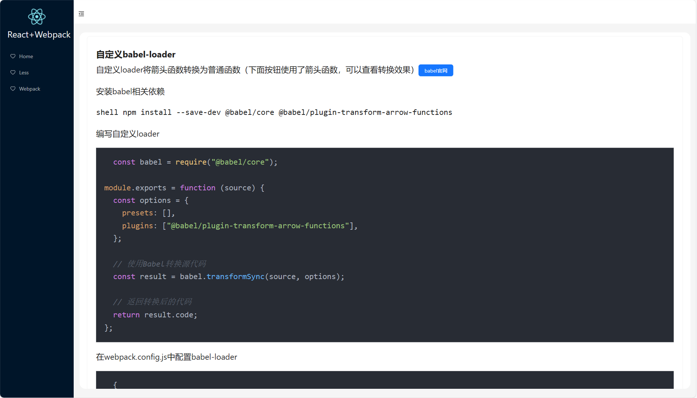
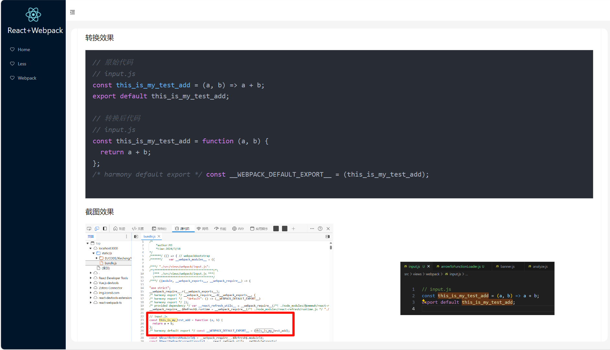

## 项目介绍
- 本项目是一个简单的react项目，用于学习webpack的配置,同时自定义了一些简单的loader和plugin用于学习打包的过程

## 项目运行
```shell
git clone https://github.com/MJ-young/react-webpack-ts.git
npm install
npm start
```

## 项目打包
```shell
npm run build
```

## 界面展示
- 首页
    - 
- Less页面
    - 
- Webpack页面
    - 
    - 
    - 
    - 
